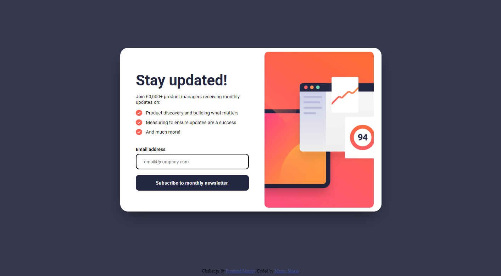
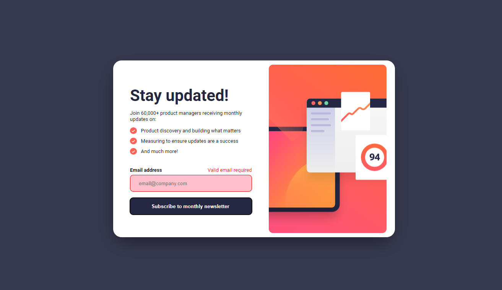
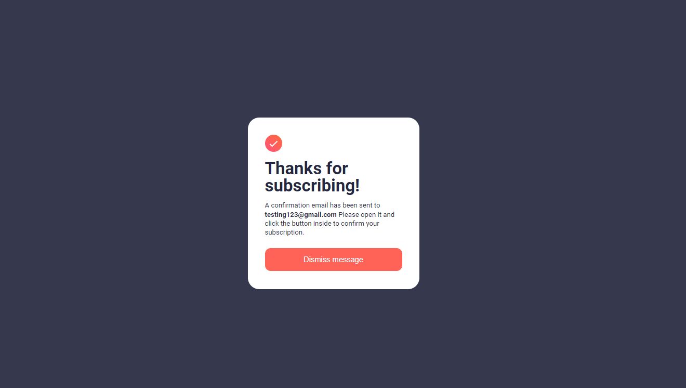
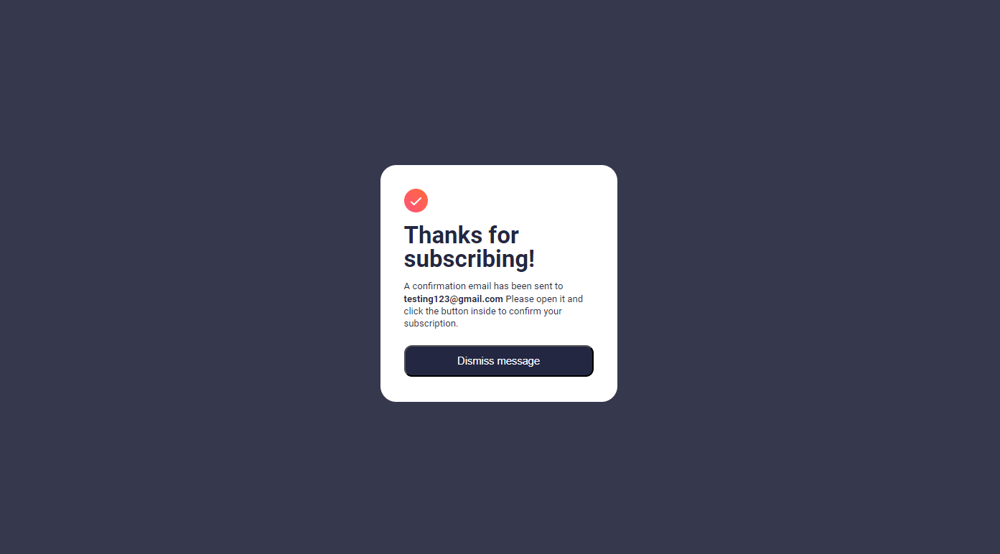
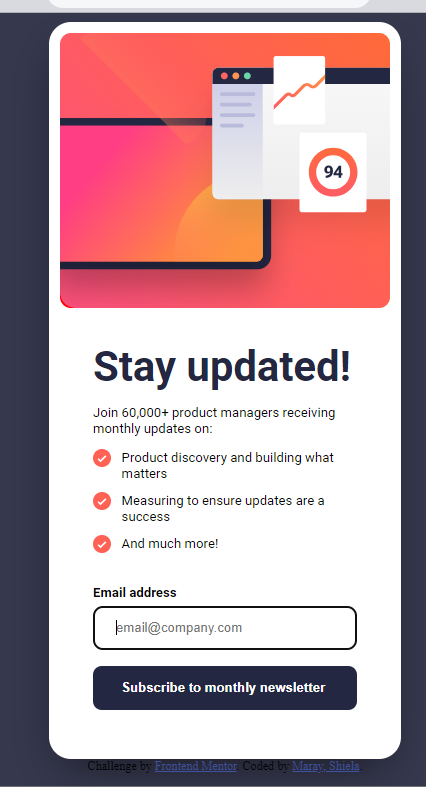
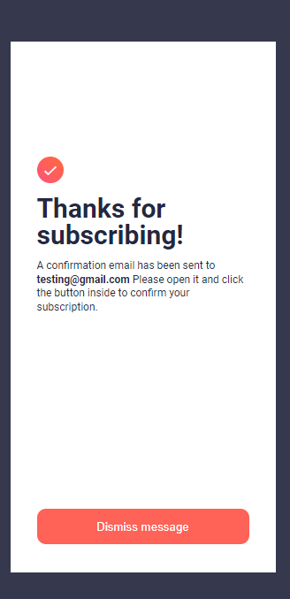

# Frontend Mentor - Newsletter sign-up form with success message solution

This is a solution to the [Newsletter sign-up form with success message challenge on Frontend Mentor](https://www.frontendmentor.io/challenges/newsletter-signup-form-with-success-message-3FC1AZbNrv). Frontend Mentor challenges help you improve your coding skills by building realistic projects. 

## Table of contents

- [Overview](#overview)
  - [The challenge](#the-challenge)
  - [Screenshot](#screenshot)
  - [Links](#links)
- [My process](#my-process)
  - [Built with](#built-with)
  - [What I learned](#what-i-learned)
  - [Continued development](#continued-development)
  - [Useful resources](#useful-resources)
- [Author](#author)
- [Acknowledgments](#acknowledgments)

## Overview

### The challenge

Users should be able to:

- Add their email and submit the form
- See a success message with their email after successfully submitting the form
- See form validation messages if:
  - The field is left empty
  - The email address is not formatted correctly
- View the optimal layout for the interface depending on their device's screen size
- See hover and focus states for all interactive elements on the page

### Screenshot









### Links
- Live Site URL: (https://your-live-site-url.com](https://marayshiela.github.io/newsletter-sign-up/))

## My process
- design a layout using HTML semantics
- Insert content and HTML elements.
- Apply CSS styling
- Check the page's responsiveness.
- Include JS code for validation and data passing.
- Review the page's responsiveness and validation.
  various types of screens

### Built with
- Semantic HTML5 markup
- CSS custom properties
- Flexbox
- CSS Grid
- Mobile-first workflow
- Javascript

### What I learned
In this challenge, I discovered that we can pass data and display it using local storage or session storage. These codes can be done with javascript, which makes this web page look more interactive.  I also learned that email validation is a bit difficult because there are a lot of regular expressions that we must consider in order to validate email. 

```
```css
box-shadow: -5px 10px 21px 5px rgba(255,102,102,0.21);
```
```js
const userEmail = email.value;
  sessionStorage.setItem('email', userEmail);
  window.location.href="success.html"
  
```

### Continued development
-Javascript
-Form validation

### Useful resources
- [Javascript Form Validation](https://www.youtube.com/watch?v=In0nB0ABaUk&t=317s) - This really helped me to understand and apply the methods in this challege.
- [Pass variable value](https://www.youtube.com/watch?v=x0VcigW9kN0&list=PLfM6M2SzfsjLX6g8Bmx6uO-wRVzGhA5Be&index=1&pp=gAQBiAQB) - This is help me to do the passing of data stored in a variable.


## Author
- Website - [maray,shiela](https://www.your-site.com)
- Frontend Mentor - [@marayshiela](https://www.frontendmentor.io/profile/marayshiela)


## Acknowledgments
Thanks FrontEnd Mentor for this challenge. i learned a lot.

